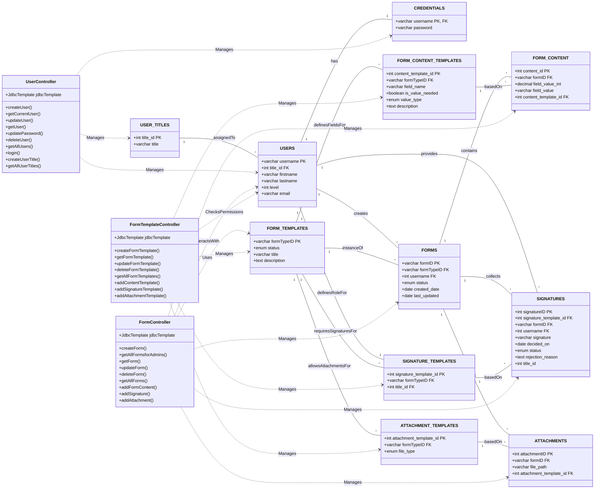

```mermaid
classDiagram
    direction LR

    class USERS {
        +varchar username PK
        +int title_id FK
        +varchar firstname
        +varchar lastname
        +int level
        +varchar email
    }

    class USER_TITLES {
        +int title_id PK
        +varchar title
    }

    class CREDENTIALS {
        +varchar username PK, FK
        +varchar password
    }

    class FORM_TEMPLATES {
        +varchar formTypeID PK
        +enum status
        +varchar title
        +text description
    }

    class FORMS {
        +varchar formID PK
        +varchar formTypeID FK
        +int username FK
        +enum status
        +date created_date
        +date last_updated
    }

    class FORM_CONTENT {
        +int content_id PK
        +varchar formID FK
        +decimal field_value_int
        +varchar field_value
        +int content_template_id FK
    }

    class FORM_CONTENT_TEMPLATES {
        +int content_template_id PK
        +varchar formTypeID FK
        +varchar field_name
        +boolean is_value_needed
        +enum value_type
        +text description
    }

    class SIGNATURE_TEMPLATES {
        +int signature_template_id PK
        +varchar formTypeID FK
        +int title_id FK
    }

    class SIGNATURES {
        +int signatureID PK
        +int signature_template_id FK
        +varchar formID FK
        +int username FK
        +varchar signature
        +date decided_on
        +enum status
        +text rejection_reason
        +int title_id
    }

    class ATTACHMENTS {
        +int attachmentID PK
        +varchar formID FK
        +varchar file_path
        +int attachment_template_id FK
    }

    class ATTACHMENT_TEMPLATES {
        +int attachment_template_id PK
        +varchar formTypeID FK
        +enum file_type
    }

    class UserController {
        +JdbcTemplate jdbcTemplate
        +createUser()
        +getCurrentUser()
        +updateUser()
        +getUser()
        +updatePassword()
        +deleteUser()
        +getAllUsers()
        +login()
        +createUserTitle()
        +getAllUserTitles()
    }
    class FormController {
       +JdbcTemplate jdbcTemplate
       +createForm()
       +getAllFormsforAdmins()
       +getForm()
       +updateForm()
       +deleteForm()
       +getAllForms()
       +addFormContent()
       +addSignature()
       +addAttachment()
    }
    class FormTemplateController {
        +JdbcTemplate jdbcTemplate
        +createFormTemplate()
        +getFormTemplate()
        +updateFormTemplate()
        +deleteFormTemplate()
        +getAllFormTemplates()
        +addContentTemplate()
        +addSignatureTemplate()
        +addAttachmentTemplate()
    }

    USERS "1" -- "1" CREDENTIALS : has
    USER_TITLES "1" -- "*" USERS : assignedTo
    USERS "1" -- "*" FORMS : creates
    USERS "1" -- "*" SIGNATURES : provides
    USERS "1" -- "1" SIGNATURE_TEMPLATES : definesRoleFor

    FORM_TEMPLATES "1" -- "*" FORMS : instanceOf
    FORM_TEMPLATES "1" -- "*" FORM_CONTENT_TEMPLATES : definesFieldsFor
    FORM_TEMPLATES "1" -- "*" SIGNATURE_TEMPLATES : requiresSignaturesFor
    FORM_TEMPLATES "1" -- "*" ATTACHMENT_TEMPLATES : allowsAttachmentsFor

    FORMS "1" -- "*" FORM_CONTENT : contains
    FORMS "1" -- "*" SIGNATURES : collects
    FORMS "1" -- "*" ATTACHMENTS : has

    FORM_CONTENT_TEMPLATES "1" -- "*" FORM_CONTENT : basedOn
    SIGNATURE_TEMPLATES "1" -- "*" SIGNATURES : basedOn
    ATTACHMENT_TEMPLATES "1" -- "*" ATTACHMENTS : basedOn

    UserController ..> USERS : Manages
    UserController ..> CREDENTIALS : Manages
    UserController ..> USER_TITLES : Manages

    FormController ..> FORMS : Manages
    FormController ..> FORM_CONTENT : Manages
    FormController ..> SIGNATURES : Manages
    FormController ..> ATTACHMENTS : Manages
    FormController ..> USERS : InteractsWith
    FormController ..> FORM_TEMPLATES : Uses

    FormTemplateController ..> FORM_TEMPLATES : Manages
    FormTemplateController ..> FORM_CONTENT_TEMPLATES : Manages
    FormTemplateController ..> SIGNATURE_TEMPLATES : Manages
    FormTemplateController ..> ATTACHMENT_TEMPLATES : Manages
    FormTemplateController ..> USERS : ChecksPermissions

``` 